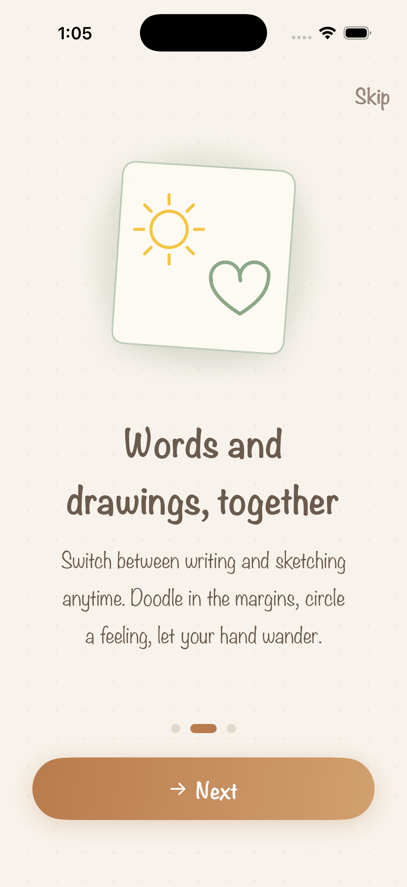
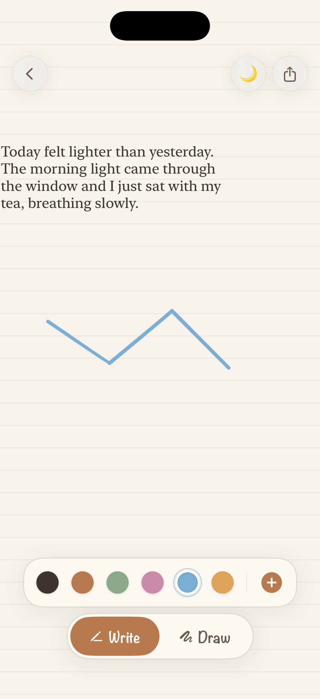
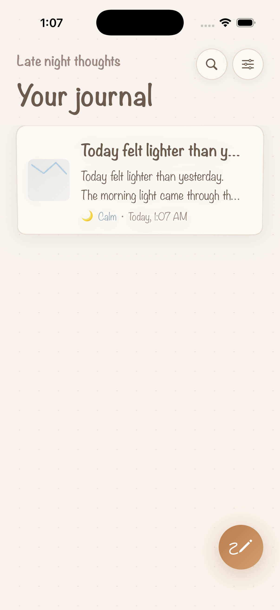
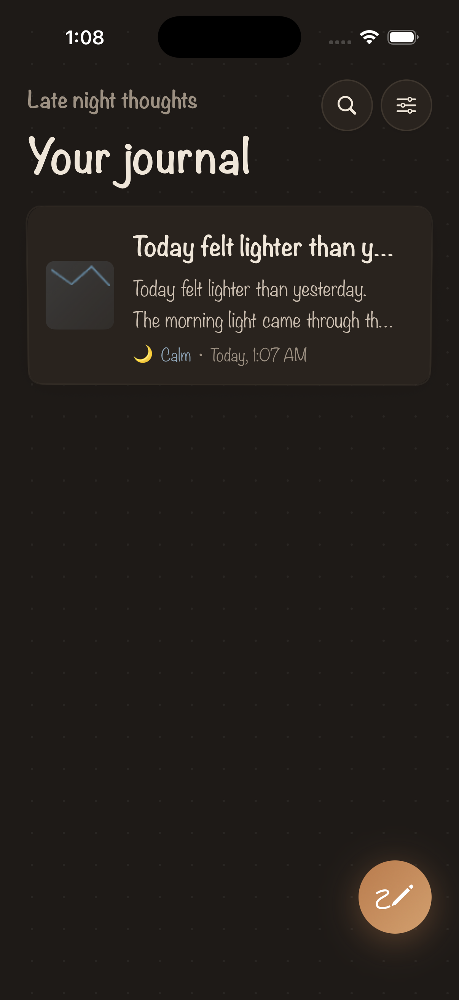

<div align="center">


<br/>


# Brume

**A calm, hand-drawn journal where your words and your sketches live on the same page.**

*breathe · write · draw*

<br/>


</div>

---

## ✦ What is Brume?

Brume is a journaling app built around one simple feeling: **the relief of letting your thoughts out.**

Some days you want to write. Some days you just want to doodle a little cloud in the margin. Brume doesn't make you choose — you can do both, anywhere on the page, on the same soft sheet of paper. Tap to write a thought, switch to draw and sketch over it, set a gentle mood, and let it go.

Everything is wrapped in a warm, hand-drawn aesthetic with colours chosen to soften the mind — warm terracotta, sage, and cream — so the app itself feels like a deep breath.

> Brume keeps **everything on your device.** Nothing is ever uploaded. Your journal is yours alone.

---

## ✦ Screenshots

<div align="center">

| Onboarding | The Page | Journal · Day | Journal · Night |
|:---:|:---:|:---:|:---:|
|  |  |  |  |

</div>

---

## ✦ Features

🖊️ **One unified page for words _and_ drawings**
Tap anywhere in Write mode to drop a note, then flip to Draw mode and your finger or Apple Pencil becomes a pen. Move notes around freely. There are no boxes, no rules — just your page.

🎨 **A palette that soothes**
Six soft inks (ink, clay, sage, rose, sky, amber) for both writing and drawing. Pen, pencil, marker, and eraser tools, all in a quiet hand-drawn toolbar.

🌫️ **A hand-drawn soul**
Sketchy borders, lined and dotted paper textures, handwriting typography (Noteworthy), and illustrations drawn entirely in code — nothing about Brume looks "coded."

🌙 **Moods, gently**
Tag an entry with how you felt — Happy, Calm, Tender, Alive, or Grateful — with a single tap. No streaks, no pressure.

🌗 **Light & dark, both beautiful**
A warm cream daytime theme and a deep-indigo night theme. Every colour adapts so the page is always easy on the eyes.

📄 **Export to PDF**
Turn any entry — text and drawing together — into a clean PDF on cream paper, ready to share or keep.

🔒 **Private by design**
Local-only storage with SwiftData. Optional Face ID lock so your journal stays just for you.

🔔 **Gentle reminders**
An optional soft daily nudge to take a moment for yourself — worded kindly, never naggy. Off by default.

🧭 **A friendly first run**
A splash screen, a three-step onboarding, and an in-canvas coach that shows you the unified page the first time you open it.

---

## ✦ Design philosophy

Brume is built on the idea that a wellness app should *feel* well.

- **Colours that calm.** The palette leans on warm terracotta, sage and cream — earthy, grounding tones — instead of high-contrast, attention-grabbing UI.
- **Imperfect on purpose.** Card borders are drawn with a tiny, deterministic jitter so they look sketched by hand rather than rendered by a machine.
- **Readable where it matters.** Handwriting fonts give the app its character on titles and labels, while journal text itself is set in a calm serif for comfortable reading.
- **No pressure mechanics.** No streaks, no badges, no guilt. Reminders are soft and optional.

---

## ✦ Tech stack

| Area | Choice |
|---|---|
| UI | **SwiftUI** (iOS 17+) |
| Persistence | **SwiftData** — local, on-device |
| Drawing | **PencilKit** (finger + Apple Pencil) |
| Export | **PDFKit / UIGraphics** |
| Security | **LocalAuthentication** (Face ID) |
| Notifications | **UserNotifications** (local + background) |
| Icon & banner | Generated from code with **CoreGraphics** — zero image assets |
| Project | **XcodeGen** (`project.yml`) |

No third-party dependencies. The whole app is native Apple frameworks.

---

## ✦ Project structure

```
Brume/
├── project.yml                  # XcodeGen project definition
├── Brume/
│   ├── App/                     # App entry point, splash routing, scene phase
│   ├── Models/                  # Entry, TextAnnotation, Mood, AppSettings, LockManager
│   ├── Theme/                   # BrumeTheme (colours, fonts), hand-drawn components
│   ├── Views/
│   │   ├── Splash/              # Animated self-drawing "B" splash
│   │   ├── Onboarding/          # 3-step onboarding + code-drawn illustrations
│   │   ├── Home/                # Journal list, entry cards, lock screen
│   │   ├── Canvas/              # The unified editor (PencilKit + draggable text)
│   │   └── Settings/            # Appearance, privacy, reminders, about
│   ├── Notifications/           # NotificationManager + AppDelegate
│   ├── Export/                  # PDFExporter
│   └── Assets.xcassets/         # Adaptive colours + generated app icon
└── Tools/                       # generate_icon.swift, generate_banner.swift
```

---

## ✦ Getting started

### Requirements
- macOS with **Xcode 16+**
- iOS 17+ simulator or device
- [XcodeGen](https://github.com/yonaskolb/XcodeGen) (`brew install xcodegen`)

### Build & run
```bash
# 1. Generate the Xcode project
xcodegen generate

# 2. Open it
open Brume.xcodeproj

# 3. Select an iPhone or iPad simulator and hit ⌘R
```

Or from the command line:
```bash
xcodebuild -project Brume.xcodeproj -scheme Brume \
  -sdk iphonesimulator -destination 'platform=iOS Simulator,name=iPhone 17' build
```

### Regenerating the icon & banner
Both are generated from code — no design tools needed:
```bash
swift Tools/generate_icon.swift     # → Brume/Assets.xcassets/AppIcon.appiconset/AppIcon-1024.png
swift Tools/generate_banner.swift   # → Docs/banner.png
```

---

## ✦ Roadmap

Brume 1.0 is a complete, self-contained first version. Ideas being considered next:

- [ ] iCloud sync (opt-in, end-to-end)
- [ ] Multiple pages per entry / infinite vertical canvas
- [ ] More paper styles and ink textures
- [ ] Handwriting-to-text (Scribble) for the whole page
- [ ] Apple Watch quick-capture

---

## ✦ Privacy

Brume collects **nothing**. There is no account, no analytics, no network code. Your entries, drawings and moods are stored locally on your device with SwiftData and never leave it. PDF exports are created on-device and only shared when *you* choose to share them.

---

## ✦ License

Released under the [MIT License](LICENSE). You're free to use, study, and build on Brume.

<div align="center">
<br/>

*Made with care.* 🌫️
**breathe · write · draw**

</div>
